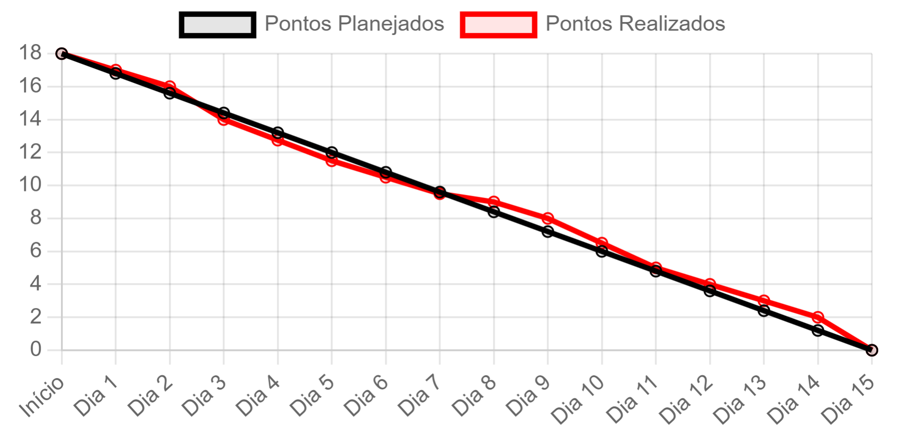

# NutriWise

### Olá, seja bem-vindo!
Somos a equipe de desenvolvimento WiseBuilders, apresentamos a Nutriwise, uma aplicação que auxilia no controle e balanceamento de nutrientes e calorias para buscar o melhor da sua saúde!
 
Além do controle de nutrientes, a Nutriwise possibilita ao usuário:
- Controle de peso a partir de gráficos, registro do peso diário, para melhor análise de comparação.
- Exercícios físicos praticados e o quanto reduzem as suas calorias a partir do tempo que são realizados.
- Criação de Cardápio de refeições para que o usuário possa montar e registrar mais de uma vez a mesma refeição, garantindo praticidade e versatilidade.
- Cálculo de IMC (Índice de Massa Corpórea) e TMB (Taxa de Metabolismo Basal) realizados diariamente.
- Página Informativa sobre os riscos de não balancear a quantidade de nutrientes nas refeições e suas consequências.
  
### Equipe WiseBuilders
- **Scrum Master:** Luana Pinheiro https://github.com/Luana873
- **Product Owner:** Junior Signorini https://github.com/JorgeJuniorSignorini
- **Desenvolvedor:** Edlaine Souza https://github.com/edlaine-souza
- **Desenvolvedor:** Luiz Fernando https://github.com/Luizfsn26
- **Desenvolvedor:** Nicolas Henrique https://github.com/NICOLAShsdo
- **Desenvolvedor:** Rodrigo Augusto https://github.com/rodrigoaslima
 
### Tecnologias Utilizadas
- **Prototipagem de telas:** (Figma) https://www.figma.com/design/Qtldmop778ivbphTyNhUqA/NutriWise-Interface?node-id=16-2&t=24rc7vbPM5bGp5C6-1
- **Frontend:** HTML, CSS, TypeScript, ReactJS
- **Backend:** Node.js, Express
- **Banco de Dados:** Postgres
- **Controle de Versão:** GitHub
- **Controle de Atividades e Funções:** Trello : https://trello.com/invite/6503773d674a729dd8be5e78/ATTI81c21e97e3b9107b3078e3b91580ca7b69ABCE3B
 
##  Backlog do Produto
| User Stories      |
|---------------------|
| Tela Inicial |
| Telas de Cadastro |
| Tela de Login |
| Tela Perfil/Home |
| Tela Página Informativa |
| Tela Cálculo de IMC e TMB |
| Tela Peso |
| Gráfico de Peso |
| Tela Registro de Calorias 
| Gráfico cálculo diário de calorias |
| Tela Pesquisa de Alimentos |
| Tela Exercícios Físicos |
| Tela Histórico de Registros |
| Documentação Github |
| Trello - Início de planejamento |
| Figma - Protótipo |
| Conexão ao banco de dados utilizando 'pg' client |
| Criação do banco de dados |
| Inserção de dados tabela TACO |
 
 
###
###
## Sprint 1 Backlog:
| Requisitos        |  Progresso                       |
|---------------------|---------------------------------|
| Tela Inicial    | **Finalizado**         |
| Telas de Cadastro    | **Finalizado**        |
| Tela de Login  | **Finalizado**         |
| Tela Perfil/Home  | **Finalizado**         |
| Github - Documentação | **Finalizado**        |
| Figma - Protótipo | **Finalizado**        |
| Trello - Início de planejamento | **Finalizado**        |

 ###
###
## Sprint 2 Backlog:
| Requisitos        |  Progresso                       |
|---------------------|---------------------------------|
| Inserção de dados tabela TACO    | **Finalizado**         |
| Criação Banco de Dados    | **Finalizado**        |
| Criação Backend    | **Finalizado**        |
| Conexão da página de Login ao Banco de Dados  | **Finalizado**         |
| Conexão da página de Cadastro ao Banco de Dados  | **Finalizado**         |

###
###
## Sprint 3 Backlog:
| Requisitos        |  Progresso                       |
|---------------------|---------------------------------|
| Tela Registro de Calorias    | **Finalizado**         |
| Telas de Controle de Peso    | **Finalizado**        |
| Tela Pesquisa de Alimentos | **Finalizado**         |
| Gráfico Tela de Controle de Peso | **Finalizado**         |

###
###
## Gráfico de Burndown:
## Sprint 1

###
###
## Gráfico de Burndown:
## Sprint 2

###
## Gráfico de Burndown:
## Sprint 3

